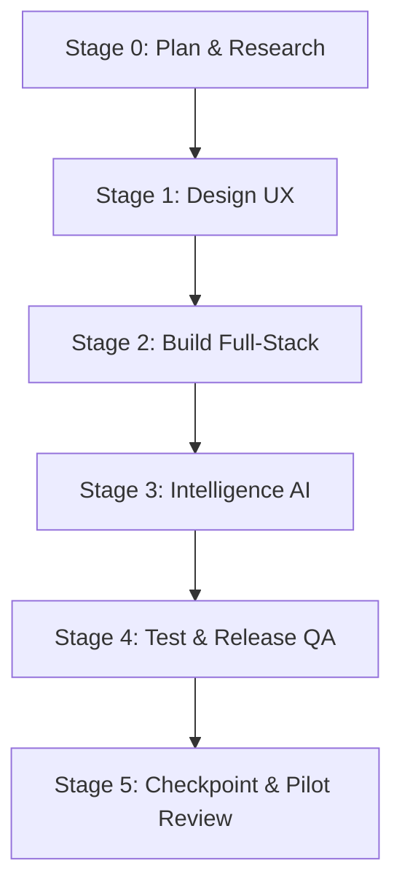

# ComplyPilot — Detailed Version 1 Plan (v1)

**Product Vision:** A streamlined collaboration, status, and compliance tracking layer connecting Indian Chartered Accountants (CAs) and MSME (Micro, Small, and Medium Enterprises) factory owners. ComplyPilot sits on top of existing tools like Tally and Winman without replacing them.

**v1 Release Theme:** "CA Workspace + Licence Tracker"  
**Target Delivery Window:** 18 weeks (~10 hours/week = ~180 engineering hours)  
**Primary Users:** 2–3 pilot CA firms managing accounting and compliance for manufacturing units.

---

## 1. Executive Summary & Problem Definition

### 1.1 The Problem
Indian CAs serving manufacturing MSMEs currently track critical tax filings and factory regulatory deadlines using fragmented Excel sheets, WhatsApp messages, and physical registers:
1. **Tax Deadlines Slip:** Filings like GSTR-3B, GSTR-1, PMT-06, TDS deposits (Challan 281), PF, and ESIC have varying frequencies and due dates depending on client turnover and state. Missed dates trigger heavy late fees (₹50/day under GST) and interest (18% p.a.).
2. **Factory Licences Fall Through the Cracks:** Manufacturing units require continuous operational approvals—Factories Act licences, Pollution Control Board Consents (CTE/CTO), Fire NOCs, Boiler inspections, and PESO permits. CAs are often blamed when a client's factory is fined or shuttered due to an expired licence.
3. **No Single Truth:** CA partners and audit assistants lack real-time visibility into which clients have submitted data, which returns are pending, and which acknowledgements (ARNs) are filed.

### 1.2 The v1 Solution
ComplyPilot v1 delivers a fast, tenant-isolated workspace where CA firms can:
- View an interactive monthly compliance grid of all manufacturing clients and their statutory filings.
- Automatically compute accurate due dates based on client classification and government notifications.
- Store filing proofs (ARN and receipt PDFs) with an immutable audit log.
- Track industrial factory licences with proactive 90/60/30-day expiry alerts.
- Extract client registration data automatically from GST certificates using grounded AI.

---

## 2. Scope Boundaries

### 2.1 In Scope (v1 MVP)
1. **Firm Authentication & DPDP Consent:**
   - Multi-tenant sign-up for CA firms with explicit privacy notice and consent logging under the Indian Digital Personal Data Protection Act (DPDP).
   - Colleague invitation link allowing firm team members equal administrative access (flat team model; no complex RBAC in v1).
2. **Client Management:**
   - Manual client entry and bulk CSV import with detailed row-by-row error validation reporting.
   - Client compliance profile configuration:
     - GST: Regular Monthly, QRMP (Quarterly Returns, Monthly Payment), or Composition (CMP-08).
     - TDS (Tax Deducted at Source): Monthly Challan 281 and Quarterly Returns (24Q, 26Q, 27Q).
     - PF (Provident Fund - ECR) & ESIC (Employee State Insurance).
     - Income Tax: Audit (Tax Audit u/s 44AB) vs. Non-Audit.
     - State of operation (determines QRMP due date split).
3. **Automated Statutory Due-Date Engine:**
   - Deterministic calculation of filing deadlines according to Indian tax laws.
   - Centralized **Date Override** mechanism: when the Ministry of Finance or GST Council extends a deadline via notification, a single update reflects instantly across all clients.
4. **The Master Compliance Grid:**
   - High-performance matrix view: Clients (rows) × Filings for selected month (columns).
   - Dynamic status per filing cell: `Not started`, `Waiting on client`, `Done`, `Late`.
   - Instant filtering by status, filing category, and client tags.
5. **Filing Execution & Proof Capture:**
   - Mark filing done with Government Acknowledgement Reference Number (ARN) / Challan CIN/BSR.
   - Receipt file upload (PDF/PNG/JPG up to 10 MB) stored in secure, tenant-isolated storage.
   - Audit trail capturing who uploaded the proof and timestamp.
6. **Manufacturing Licence Tracker:**
   - Dedicated tracker for industrial permissions: Factories Act Licence, PCB CTE/CTO, Fire Safety NOC, Boiler Certificate, PESO (Explosives/Gas), Weights & Measures.
   - Handles both expiring licences and lifetime/valid-until-cancelled licences.
   - Automated visual alert stages: 90 days, 60 days, 30 days remaining, and Expired.
7. **Grounded AI Extractor (Stage 3):**
   - Upload GST Registration Certificate (Form GST REG-06) PDF to auto-populate client details (Legal Name, Trade Name, GSTIN, Address, State, Constitution).
   - Human-in-the-loop: highlights source text snippets on screen; requires explicit CA confirmation before writing to database.

### 2.2 Explicitly Out of Scope (Deferred to Future Versions)
| Feature | Target Version / Reason |
|---|---|
| Granular Staff Roles & Permissions | Backlog (v1 uses flat firm access) |
| Direct Tally / Winman File or ODBC Sync | Backlog (requires on-prem agent & sample database research) |
| WhatsApp Bot for Client Reminders & Document Requests | v2 (requires WhatsApp Business API registration and template approval) |
| Factory Owner Self-Serve Portal & Health Score | v3 (requires dedicated client-facing auth and mobile UX) |
| State-by-State Dynamic Licence Applicability Engine | v3 (requires deep regulatory matrix per state industrial policy) |
| Direct Government Portal Scraping / Captcha Solvers | Backlog (avoid fragile scraping and storing government passwords) |
| CA Practice Invoicing, Billing & Time-Tracking | Backlog (ComplyPilot is a compliance layer, not an ERP) |

---

## 3. Measurable Success Metric & Acceptance Criteria

### 3.1 Primary Success Metric
At least **2 pilot CA firms** run their actual client compliance tracking through ComplyPilot for one full monthly cycle (target: January 2027 filings), with at least **80% of all eligible client filings** marked as done with valid ARNs/receipts in the platform.

### 3.2 Acceptance Criteria (12 Verification Gates)
1. **Firm Sign-up & Access:** A CA firm creates an account, accepts DPDP privacy terms (recorded with timestamp, user ID, and terms version), and successfully invites a colleague who accesses the same workspace.
2. **Multi-Tenant Data Separation:** Postgres Row Level Security (RLS) guarantees that Firm A cannot query, view, modify, or download any client record, filing, licence, or file belonging to Firm B. Automated tests verify this on every table and storage bucket.
3. **Robust CSV Import:** Uploading a 100-row CSV with 5 invalid rows (e.g., malformed GSTIN, invalid state) successfully imports 95 valid clients while generating an error report detailing row numbers and failure reasons.
4. **Statutory Due-Date Correctness:** Pure function unit tests verify accurate statutory calculation for all standard filings, including:
   - GSTR-3B monthly (20th of subsequent month).
   - QRMP GSTR-3B state split (Category 1 states on 22nd; Category 2 states on 24th).
   - March TDS payment due April 30th (instead of 7th of next month).
   - PF/ESIC due 15th of subsequent month.
5. **Global Due-Date Override:** Updating an extended statutory due date in settings propagates to all affected clients in the grid within 1 second.
6. **Grid Performance:** The grid view renders 100 clients × all filings in under 2 seconds on standard broadband, with sub-500ms client-side filter and search response.
7. **Filing Completion Proof:** Marking a filing done requires an ARN and receipt file upload. The receipt file download URL is signed and strictly restricted to users of the same firm.
8. **Licence Expiry State Machine:** Automated threshold tests confirm proper status transitions: `Normal` (>90 days), `Warning 90` (61–90 days), `Warning 60` (31–60 days), `Critical 30` (1–30 days), `Expired` (≤0 days), and `Valid Until Cancelled` (null expiry date).
9. **DPDP Compliance & Data Portability:** A CA firm can trigger an immediate one-click JSON/ZIP export of any client's full metadata and documents, or permanently purge a client record from the database and storage.
10. **AI Extraction Benchmark:** The GST REG-06 AI parser achieves ≥90% field-level accuracy on a benchmark evaluation set of 25 certificates, with 100% of suggested fields presenting source text citations prior to human confirmation.
11. **Production Infrastructure & CI/CD:** Every merge to `main` triggers automated linting, type checks, unit tests, and security scans before deploying to production. Automated daily database backups with at least one verified test restoration.
12. **Pilot UAT Sign-off:** Both pilot firms complete user acceptance testing (UAT) and confirm in writing that the software successfully managed their monthly compliance cycle.

---

## 4. Phased Execution Plan (Stages 0 to 5)

Each stage must be completed and approved before advancing to the next.

### Stage 0: Plan & Research [PM] (Weeks 1–2)
**Goal:** Validate assumptions, document statutory rules, confirm pilot partners, and freeze requirements.
- `v1-PM-1`: **Statutory Rule Matrix:** Document exact filing rules, frequencies, penalty clauses, and state categorizations for GST, TDS, PF, ESIC, and Income Tax. Mark unverified rules `UNVERIFIED`.
- `v1-PM-2`: **Industrial Licence Baseline:** Research key MSME factory compliance items: Factories Act (Form 2 renewal), State Pollution Control Boards (CTE/CTO water & air acts), Fire NOC, and Chief Controller of Explosives (PESO). Note statutory validity lengths and renewal windows.
- `v1-PM-3`: **Competitor & Alternative Benchmark:** Document workflows and pricing of Jamku, Zoho Practice, and standard CA Excel trackers to ensure ComplyPilot's manufacturer-focused differentiation is maintained.
- `v1-PM-4`: **DPDP Compliance Blueprint:** Outline data collector obligations, consent wording, retention schedules, and secure storage requirements under India's Digital Personal Data Protection Act.
- `v1-PM-5`: **CSV Import Schema:** Define canonical CSV header specifications, optional vs mandatory fields, standard validation regexes (GSTIN, PAN, TAN), and sample template files.
- `v1-PM-6`: **Pilot CA Recruitment:** Interview at least 3 manufacturing-focused CA firms using a standardized 30-minute discovery script; secure commitments from at least 2 firms for January 2027 live testing.
- `v1-PM-7`: **Long-Lead Setup:** Initiate WhatsApp Business Account (WABA) verification prerequisites needed for v2 planning.
- `v1-PM-8`: **Stage 0 Gate & Scope Freeze:** Review all findings with Lakshay, lock the v1 feature boundary, and formally freeze scope.

### Stage 1: Design [UX] (Weeks 3–4)
**Goal:** Create accessible, human-centered UI workflows tailored for high-volume CA practice.
- `v1-UX-1`: **User Journey & Navigation Flows:** Document step-by-step user journeys for firm registration, CSV bulk import, daily grid monitoring, filing completion modal, and licence expiry remediation.
- `v1-UX-2`: **Information Architecture & Wireframes:** Design clean wireframes for 7 core views:
  1. Auth & Firm Profile (with DPDP consent).
  2. Master Compliance Grid (Clients × Filings).
  3. Client Detail Page (Compliance profile + factory details).
  4. Client Import Wizard (Upload, preview, error remediation).
  5. Mark Filing Done Modal (ARN, date, receipt upload).
  6. Licence Dashboard (Urgent renewals, documents, status chips).
  7. Practice Settings (Colleague invitations, statutory date overrides).
- `v1-UX-3`: **Design System Tokens:** Define a high-contrast design system adhering to WCAG 2.1 AA accessibility standards. Status must never be conveyed by color alone—pair colors with distinct semantic icons and text chips.
- `v1-UX-4`: **High-Fidelity Prototype & Usability Testing:** Build interactive prototype in Figma; conduct usability test with one pilot CA partner (task: locate overdue GSTR-3B and mark it done with proof in under 45 seconds).
- `v1-PM-9`: **Stage 1 Gate:** Re-estimate engineering effort against the 18-week timeline and secure sign-off on design specs before writing code.

### Stage 2: Build [FS] (Weeks 5–13)
**Goal:** Implement robust, production-grade frontend, backend, database schema, and security rules.
- `v1-FS-1`: **Stack Architecture & ADRs:** Author Architecture Decision Records (ADRs) covering:
  - Application framework (e.g. Next.js / TypeScript).
  - Database, Auth & Storage (e.g. Supabase / Postgres in India region).
  - Hosting & edge infrastructure.
- `v1-QA-1`: **CI/CD Pipeline Setup:** Configure automated GitHub Actions for TypeScript type-checking, ESLint, unit testing, automated preview deployments, and Sentry error monitoring.
- `v1-FS-2`: **Data Modeling & Postgres RLS:** Construct relational tables (`firms`, `users`, `clients`, `filings`, `licences`, `audit_logs`) with strict Row Level Security policies guaranteeing tenant separation. Write automated RLS test suite.
- `v1-FS-3`: **Firm Auth & Member Invitations:** Implement email/password and magic link authentication, firm creation, DPDP consent tracking table, and colleague invite mechanism.
- `v1-FS-4`: **Client Profile Management:** Build client CRUD (Create, Read, Update, Archive) endpoints and forms with validation for GSTIN (15-character checksum), PAN, and TAN.
- `v1-FS-5`: **Deterministic Statutory Due-Date Engine:** Code the statutory engine as pure functions with 100% unit test coverage for standard filing rules, quarterly variations, leap years, and state categories.
- `v1-FS-6`: **Master Compliance Grid UI:** Develop the high-performance virtualized grid with server-side pagination, instant client-side filtering, and responsive state chips.
- `v1-FS-7`: **Mark Done & Document Storage:** Build filing completion flow with secure file upload to private S3/Supabase storage, generating short-lived signed URLs for receipt viewing.
- `v1-FS-8`: **Bulk CSV Import Engine:** Build client CSV parser with chunked batch inserts, strict validation, and comprehensive error reporting for failed rows.
- `v1-FS-9`: **DPDP Data Protection Handlers:** Build data export generator (JSON archive of client data + receipts) and cascade deletion handler for "right to be forgotten" requests.
- `v1-FS-10`: **Factory Licence Module:** Implement licence tracker with expiration calculation, document storage, and urgency badges (90/60/30 days).
- `v1-FS-11`: **Statutory Date Override System:** Admin interface allowing CAs to update government extension dates with real-time recalculation across the grid.
- `v1-QA-2`: **Early Access Pilot Handover:** Onboard pilot firms in a staging/production sandbox by Week 11 to populate initial client data.

### Stage 3: Intelligence [AI] (Weeks 14–15)
**Goal:** Deliver a reliable, grounded AI extraction tool for GST Registration Certificates.
- `v1-AI-1`: **Evaluation Dataset Compilation:** Assemble a diverse benchmark set of 25 Form GST REG-06 certificates from consenting pilot firms (scrubbing personal tax records; stored securely outside public git).
- `v1-AI-2`: **AI Extraction Pipeline:** Build server-side extraction pipeline using Gemini Flash with structured schema output (extracting Legal Name, Trade Name, GSTIN, Address, State, Date of Liability, and Registration Date).
- `v1-AI-3`: **Grounding & Human Verification:** Return confidence metrics and text source bounding snippets for every extracted attribute. Render side-by-side verification UI allowing CAs to accept or correct fields.
- `v1-AI-4`: **Evaluation Benchmark Run:** Execute automated eval runner against the benchmark set. Require ≥90% accuracy before production release; log acceptance vs edit rates in production.

### Stage 4: Test & Release [QA] (Weeks 16–17)
**Goal:** Ensure enterprise-grade reliability, security, data integrity, and pilot readiness.
- `v1-QA-3`: **Automated End-to-End (E2E) Testing:** Write Playwright E2E suites covering the 3 critical paths:
  1. Firm onboarding → Invite member → Member login.
  2. CSV client upload → Grid verification → Mark filing done with receipt.
  3. Add factory licence → Trigger 30-day warning → View document.
- `v1-QA-4`: **Security & Penetration Audit:** Execute OWASP Top 10 web audit, dependency vulnerability scanning (`npm audit`), API authorization checks, and RLS penetration tests attempting cross-firm data access.
- `v1-QA-5`: **Performance & Load Benchmarking:** Validate grid performance under load: 200 clients × 12 filing columns with simulated network latency.
- `v1-QA-6`: **Live Pilot Execution (UAT):** Supervise pilot firms tracking live January compliance filings; maintain real-time triage for bug fixes.
- `v1-QA-7`: **Disaster Recovery & Monitoring:** Conduct end-to-end database backup and restore test; verify uptime monitors and Sentry error alerting.

### Stage 5: Checkpoint & Retrospective (Week 18)
**Goal:** Finalize v1 delivery, archive development assets, and transition to v2.
- Verify all 12 Acceptance Criteria are satisfied with documented proof.
- Verify zero unlisted `// MOCK:` occurrences remain in the production codebase.
- Draft `docs/SYSTEM.md` detailing architecture, database schema, and operational runbooks.
- Tag production release `v1.0.0` with detailed `CHANGELOG.md`.
- Conduct project retrospective with pilot CA feedback; update `ROADMAP.md` and initiate v2 planning.

---

## 5. Technical Architecture & System Principles

### 5.1 Architecture Overview
- **Frontend / Client Layer:** Next.js (App Router, React, TypeScript) using a clean, accessible component architecture.
- **Backend / API Layer:** Next.js Server Actions and Route Handlers with Zod input validation.
- **Database & Row Level Security:** PostgreSQL with Row Level Security (RLS) enabled on 100% of tenant tables. Every query executes in the context of the authenticated user's `firm_id`.
- **Object Storage:** Private cloud storage buckets storing filing receipts and licence PDFs. Public access is permanently disabled; files are accessed exclusively via short-lived signed URLs.
- **AI Processing:** Server-side Gemini API invocations with strict JSON schema constraints and fallback handling.

### 5.2 Key Data Entities
1. `firms`: The tenant account representing the CA practice.
2. `users`: CA partners and assistants belonging to a firm.
3. `clients`: Manufacturing client entities owned by a firm. Contains legal name, trade name, GSTIN, PAN, factory address, and state.
4. `client_compliance_profiles`: Defines which filings apply to a client (GST frequency, TDS TAN, PF code, ESIC number, Tax Audit status).
5. `statutory_due_dates`: System calendar of base filing deadlines with support for firm or global override dates.
6. `client_filings`: Status of a specific filing for a client for a given period (`period_month`, `status`, `arn`, `receipt_url`, `completed_at`, `completed_by`).
7. `factory_licences`: Industrial permits for a client (`licence_type`, `licence_number`, `issuing_authority`, `issue_date`, `expiry_date`, `document_url`).
8. `audit_logs`: Immutable security log recording user actions, DPDP consent, filing status modifications, and data exports.

### 5.3 Technical Jargon Glossary (Explained Simply)
- **RLS (Row Level Security):** A database feature that automatically checks who is asking for data and blocks them from seeing any records that do not belong to their firm.
- **Pure Function:** A piece of code that always produces the exact same output for the same input and never modifies anything outside itself. Perfect for calculating tax due dates.
- **ADR (Architecture Decision Record):** A brief, standardized document that explains why we picked a certain technology or design, what alternatives we considered, and what trade-offs we accepted.
- **ARN (Acknowledgement Reference Number):** The unique confirmation number issued by the Indian government's portal when a tax return (like GSTR-3B) is officially submitted.
- **DPDP Act:** India's Digital Personal Data Protection Act, 2023, which establishes legal requirements for collecting, storing, and processing individuals' personal data.
- **WCAG AA:** Web Content Accessibility Guidelines Level AA—the international standard ensuring software is easily readable and usable by people with visual or physical impairments.

---

## 6. Risk Analysis & Mitigation Strategies

| Risk | Impact | Likelihood | Mitigation Strategy |
|---|---|---|---|
| **Tight Part-Time Schedule (~10 hrs/wk)** | High | Medium | Strictly adhere to the scope freeze at Stage 0. If any stage runs over budget, cut non-essential features (e.g., reduce AI document types), never test coverage or quality. |
| **Shifting Indian Tax Deadlines** | Medium | High | Decouple the due-date engine from hardcoded tables. Use pure statutory calculation functions with a centralized override interface. |
| **Pilot Firm Attrition** | High | Low | Recruit 3 CA firms during Stage 0 to guarantee at least 2 active firms for Stage 4/5 testing. Maintain weekly check-ins. |
| **DPDP Compliance Liabilities** | High | Medium | Implement data minimization from day one. Do not store government portal passwords. Provide instant data export and account deletion mechanisms. |
| **Complex Factory Licences by State** | Medium | High | Keep the v1 licence model flexible: permit arbitrary text for licence types and authorities, allow optional expiry dates ("Valid Until Cancelled"), and avoid hardcoded state rules until v3. |
| **AI Extraction Hallucinations** | Medium | Medium | Require grounded source text citations for every extracted field and mandate human confirmation before writing to the database. |

---

## 7. Version 1 Definition of Done

The v1 release is formally complete when:
- [ ] All 12 Acceptance Criteria have passed with verifiable automated tests or pilot logs.
- [ ] No unlisted `// MOCK:` references exist in the repository.
- [ ] Production application is deployed and reachable on custom domain with valid SSL.
- [ ] At least 2 CA pilot firms have managed real client filings for a full monthly cycle.
- [ ] Zero critical or high-severity security vulnerabilities in dependencies or code.
- [ ] `docs/SYSTEM.md` is compiled to document the live system architecture.
- [ ] Git repository is tagged at `v1.0.0` with accompanying release notes.
